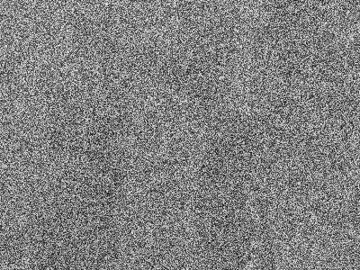

# ML2018_410421209
- [Assignment1](#image-decryption-by-a-single-layer-neural-network)

## Image decryption by a single-layer neural network

**Table of contents**
---------------------
- [Training samples](#training-samples)
- [Parameters](#parameters)
- [Weight vector](#weight-vector)
- [Display of images](#display-of-images)
- [Problems](#problems)
- [Learning experience](#learning-experience)

### Training samples
Use the data from e-Learning

### Parameters

- MaxIterLimit: 10
- α: 1e-7
- 𝜖: 1e-30

### Weight vector

|  |w1|w2|w3|
|--|--|--|--|
|value|0.25006898|0.65998043|0.0901495|

### Display of images

- *Incrypted image*

- *Decrypted image*

### Problems

### Learning experience
